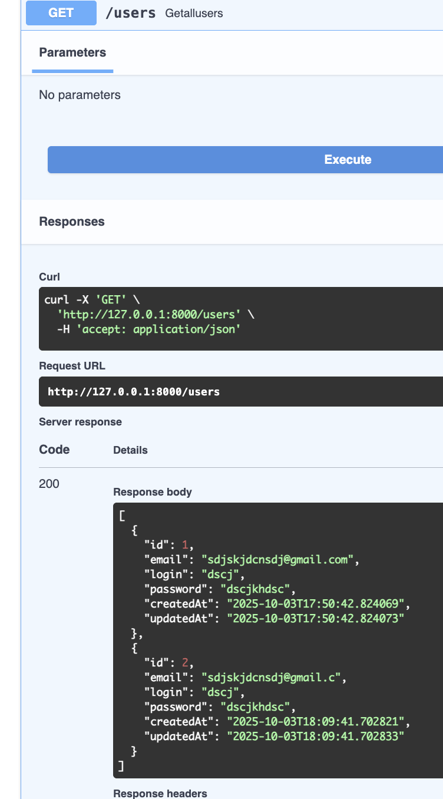
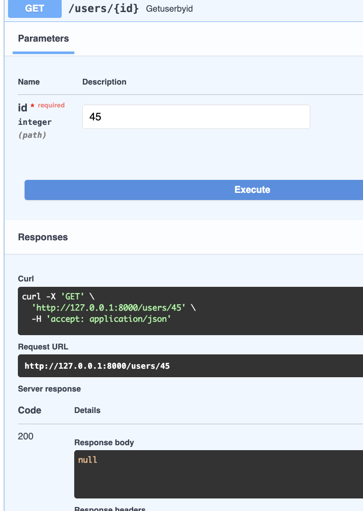
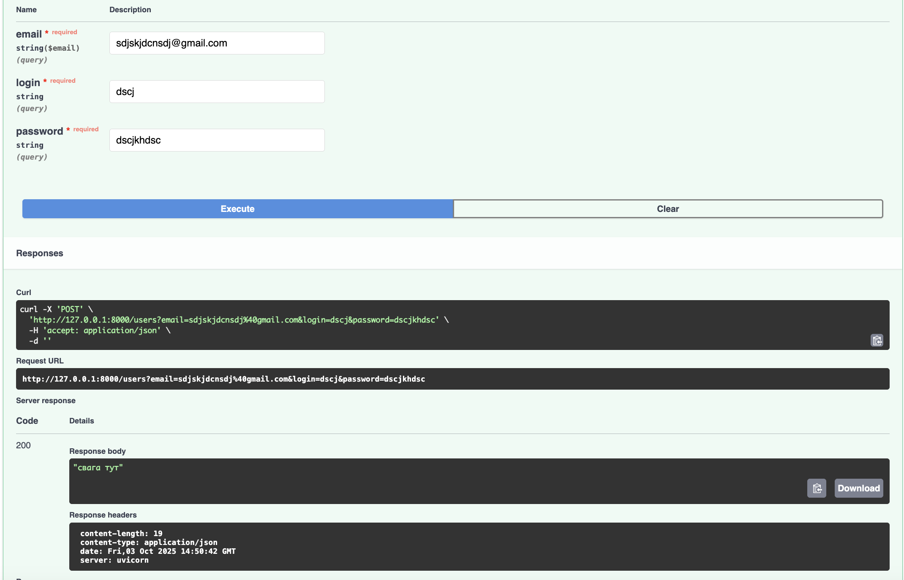
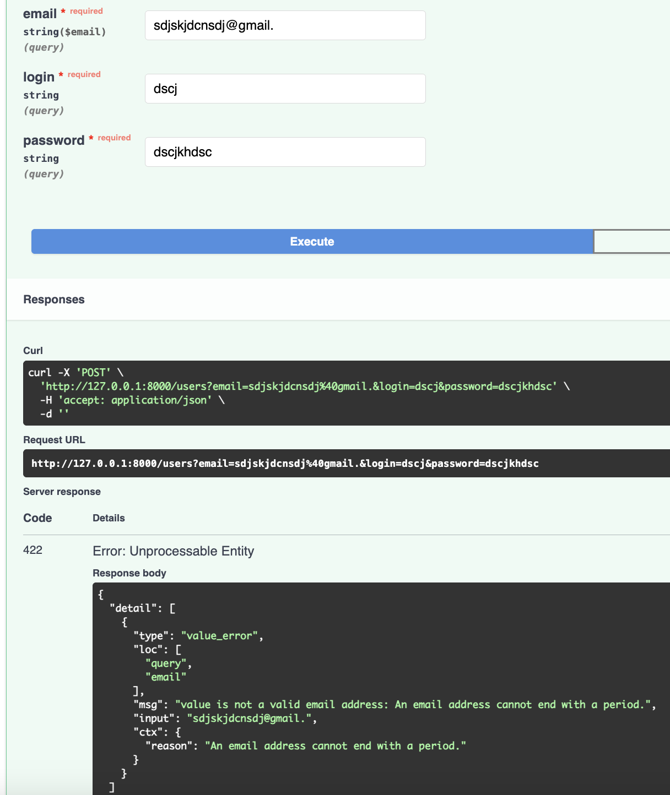
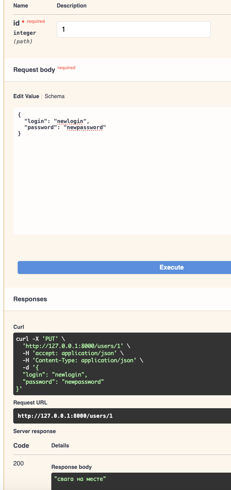
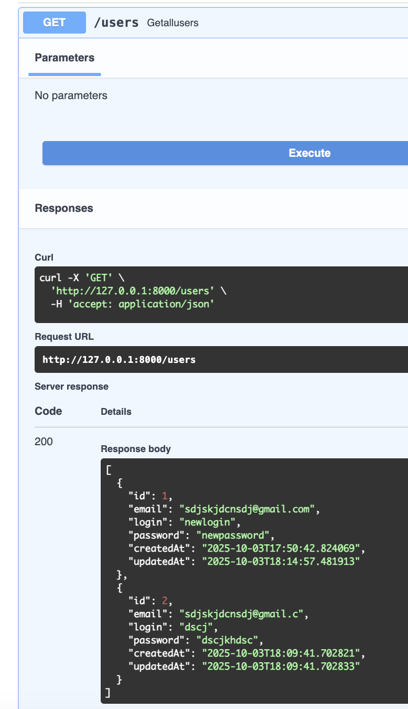
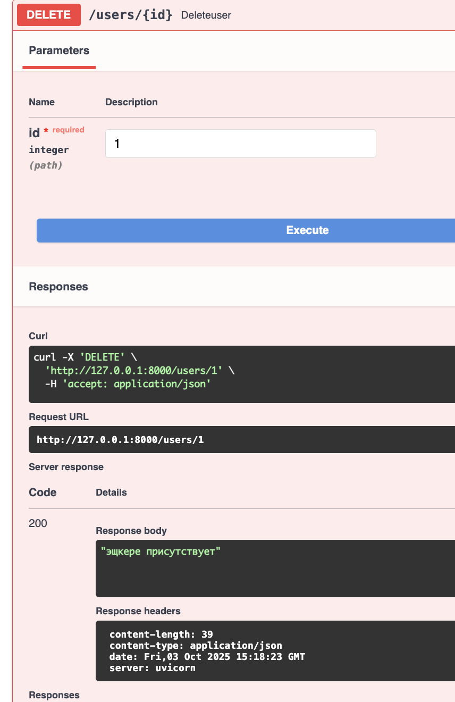
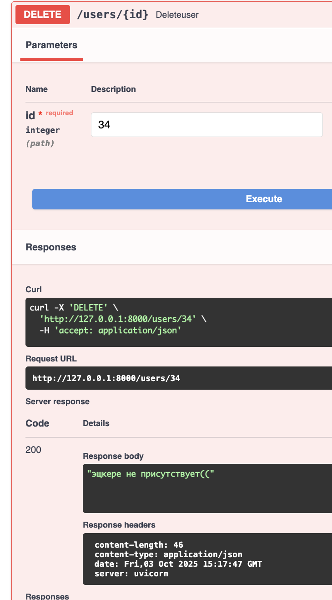

| Сценарий                                        | Скриншот                                    |
|-------------------------------------------------|---------------------------------------------|
| Получение всех пользователей (успех)            |    |
| Получение несуществующего пользователя (ошибка) |          |
| Создание пользователя (успех)                   |  |
| Создание пользователя (невалидный email)        |       |
| Обновление пользователя (успех)                 |  |
| Обновление пользователя (проверка)              |    |
| Удаление пользователя (успех)                   |  |
| Удаление пользователя (несуществующий id)       |       |


посты работают точно также, только в них ещё есть проверка существует ли authorId
```
zhestochaishiyBlog
├─ .pre-commit-config.yaml
├─ .pytest_cache
│  ├─ CACHEDIR.TAG
│  ├─ README.md
│  └─ v
│     └─ cache
│        ├─ lastfailed
│        └─ nodeids
├─ Dockerfile
├─ README.md
├─ alembic
│  ├─ README
│  ├─ env.py
│  ├─ script.py.mako
│  └─ versions
│     └─ 14660c8730ec_initial_migration.py
├─ alembic.ini
├─ app
│  ├─ __init__.py
│  ├─ alembic
│  │  ├─ env.py
│  │  ├─ script.py.mako
│  │  └─ versions
│  ├─ alembic.ini
│  ├─ core
│  │  ├─ __init__.py
│  │  ├─ config.py
│  │  ├─ database.py
│  │  └─ security.py
│  ├─ create_tables_ddl.sql
│  ├─ crud
│  │  ├─ __init__.py
│  │  ├─ comment.py
│  │  ├─ like.py
│  │  ├─ post.py
│  │  └─ user.py
│  ├─ database.py
│  ├─ dependencies.py
│  ├─ main.py
│  ├─ migrations
│  ├─ models
│  │  ├─ __init__.py
│  │  ├─ comment.py
│  │  ├─ favorite.py
│  │  ├─ like.py
│  │  ├─ post.py
│  │  └─ user.py
│  ├─ routers
│  │  ├─ __init__.py
│  │  ├─ auth.py
│  │  ├─ comments.py
│  │  ├─ likes.py
│  │  ├─ posts.py
│  │  └─ users.py
│  ├─ schemas
│  │  ├─ __init__.py
│  │  ├─ comment.py
│  │  ├─ like.py
│  │  ├─ post.py
│  │  └─ user.py
│  └─ tests
│     ├─ __init__.py
│     ├─ conftest.py
│     ├─ test.comments.py
│     ├─ test_auth.py
│     └─ test_posts.py
├─ docker-compose.yml
├─ frontend
│  ├─ README.md
│  ├─ eslint.config.js
│  ├─ index.html
│  ├─ package-lock.json
│  ├─ package.json
│  ├─ postcss.config.js
│  ├─ public
│  │  └─ vite.svg
│  ├─ src
│  │  ├─ App.tsx
│  │  ├─ assets
│  │  │  └─ react.svg
│  │  ├─ components
│  │  │  ├─ Auth
│  │  │  │  ├─ LoginForm.tsx
│  │  │  │  ├─ PrivateRoute.tsx
│  │  │  │  └─ RegisterForm.tsx
│  │  │  ├─ Comments
│  │  │  ├─ Layout
│  │  │  ├─ Posts
│  │  │  │  ├─ PostCard.tsx
│  │  │  │  ├─ PostForm.tsx
│  │  │  │  └─ PostList.tsx
│  │  │  ├─ Profile
│  │  │  ├─ Search
│  │  │  └─ common
│  │  ├─ context
│  │  │  └─ AuthContext.tsx
│  │  ├─ hooks
│  │  ├─ index.css
│  │  ├─ main.tsx
│  │  ├─ pages
│  │  │  ├─ CreatePostPage.tsx
│  │  │  ├─ HomePage.tsx
│  │  │  ├─ LoginPage.tsx
│  │  │  └─ RegisterPage.tsx
│  │  ├─ services
│  │  │  ├─ api.ts
│  │  │  ├─ authService.ts
│  │  │  └─ postService.ts
│  │  ├─ types
│  │  │  └─ index.ts
│  │  └─ utils
│  │     ├─ jwt.ts
│  │     └─ validation.ts
│  ├─ tailwind.config.js
│  ├─ tsconfig.app.json
│  ├─ tsconfig.json
│  ├─ tsconfig.node.json
│  └─ vite.config.ts
├─ poetry.lock
├─ pyproject.toml
├─ requirements.txt
└─ screens
   ├─ create_user_fail.png
   ├─ create_user_success.png
   ├─ delete_user_fail.png
   ├─ delete_user_success.png
   ├─ get_user_fail.png
   ├─ get_users_success.png
   ├─ update_user_check.png
   └─ update_user_success.png

```